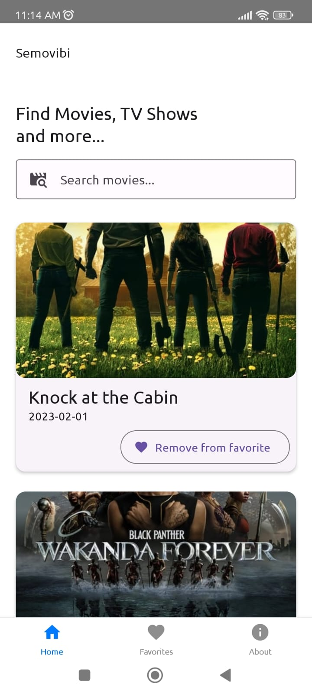
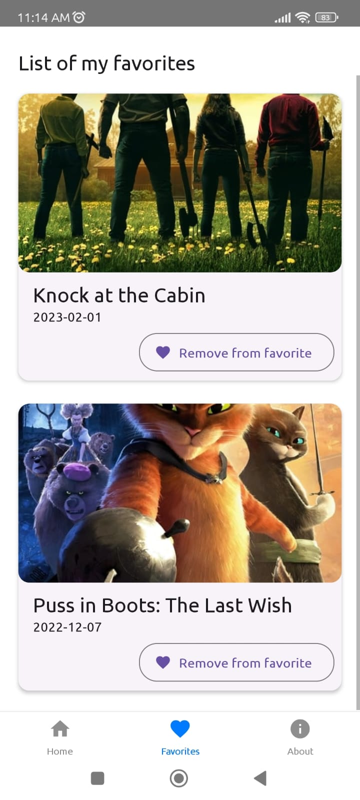

# Semovibi
Semovibi adalah aplikasi mobile untuk mencari refrensi film.
Menggunakan source yang kuat, sehingga *discoverie* jadi lebih valid.

# Tech Stack
Project ini menggunakan **React Native** sebagai basenya,
3rd party lainnya seperti Redux, React-Navigation, React-Native-Paper.

# Cara Menjalankan
Sama seperti menjalankan aplikasi react-native.
anda perlu:
1. *Clone* project ini
2. Buka terminal, dan targetkan ke path dimana repo ini di *clone*.
3. Sambungkan handphone / hidupkan emulator jagoan anda.
4. Jalankan **npm run start** untuk development
5. Tunggu proses selesai
6. Aplikasi sudah berjalan

# Gallery
;
;